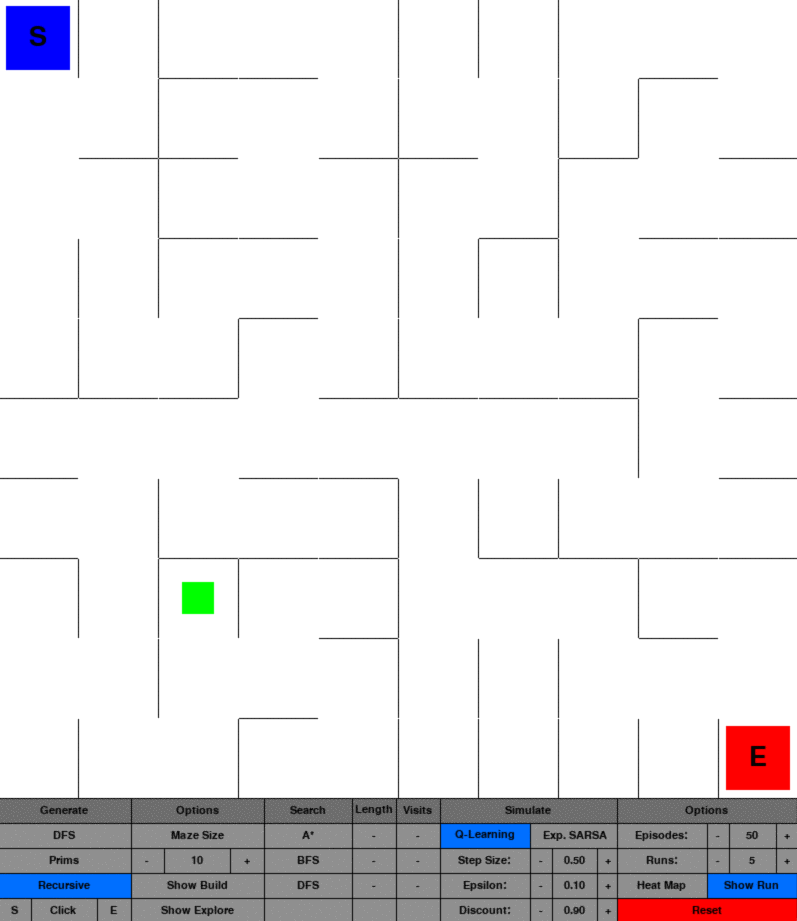
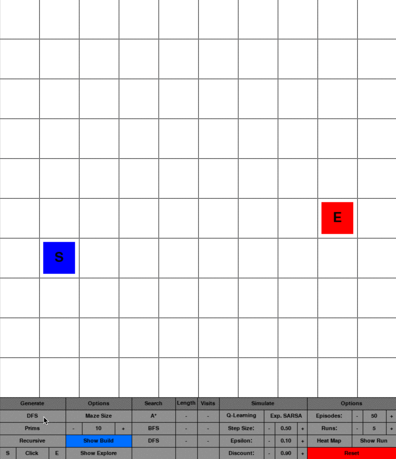
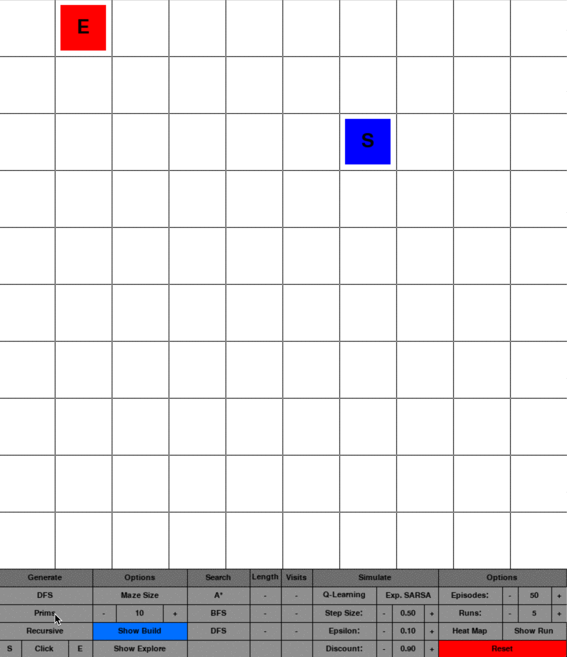
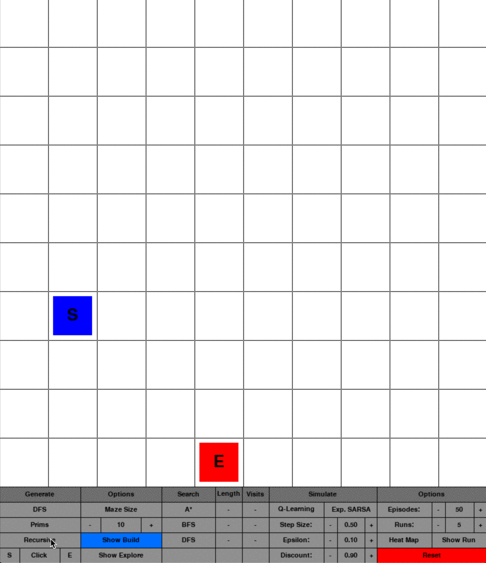
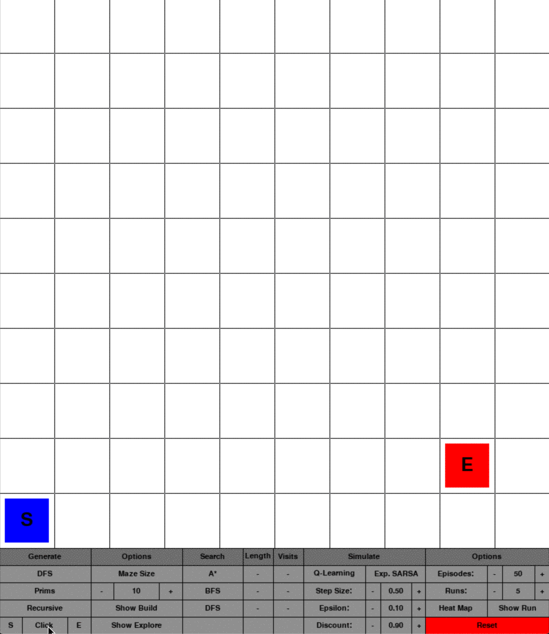
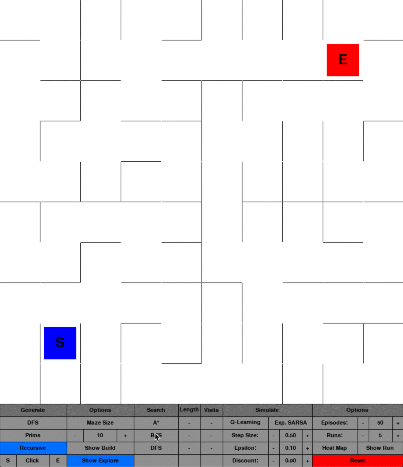
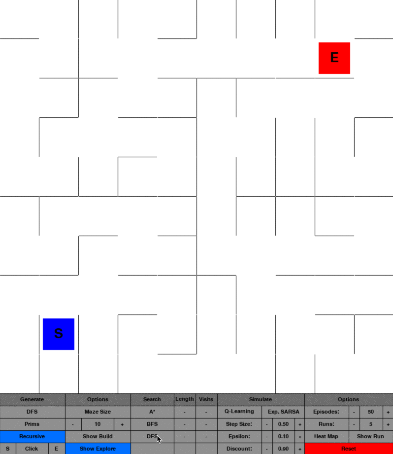
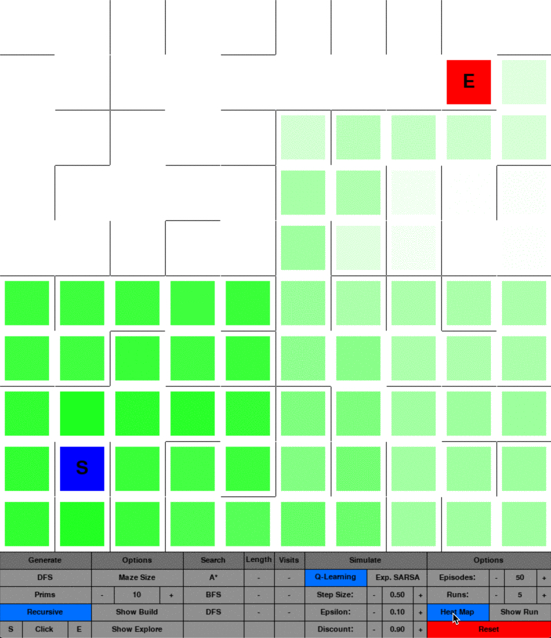
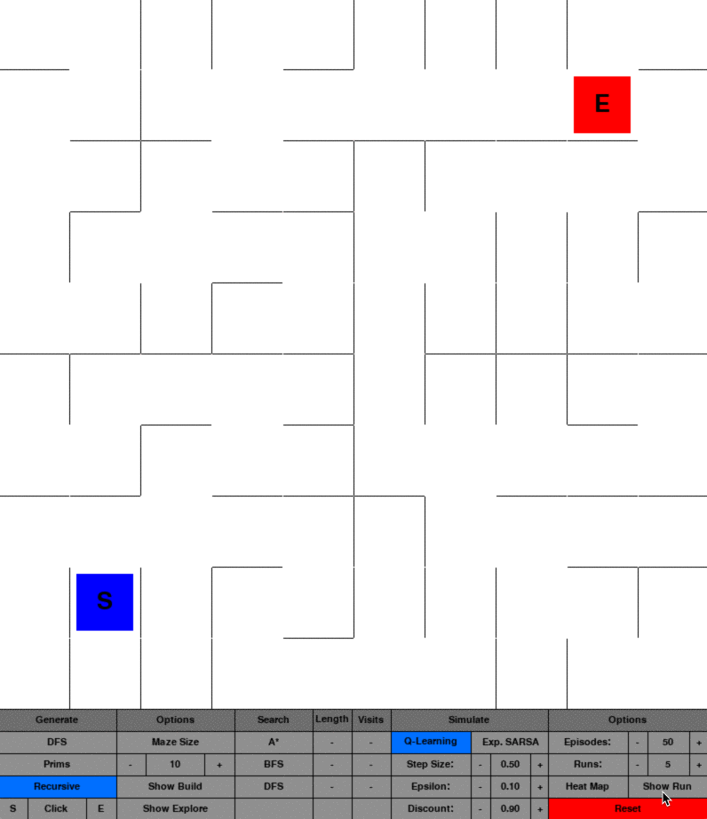

# Maze Generator and Solver

> A GUI application for creating mazes, searching the maze and simulating Q-Learning and Expected SARSA.

<p align="center">
    
</p>

## Table of Contents

- [Maze Generator and Solver](#maze-generator-and-solver)
  - [Table of Contents](#table-of-contents)
  - [Installation](#installation)
    - [Dependencies](#dependencies)
  - [Layout](#layout)
  - [Usage](#usage)
  - [Features](#features)
    - [Generate](#generate)
      - [Depth-First Search](#depth-first-search)
      - [Prim's Algorithm](#prims-algorithm)
      - [Recursive Division](#recursive-division)
      - [Click to place](#click-to-place)
    - [Search](#search)
      - [A*](#a)
      - [Breadth-First Search](#breadth-first-search)
      - [Depth-First Search](#depth-first-search-1)
    - [Simulate](#simulate)
      - [Heat Map](#heat-map)
      - [Show Run](#show-run)
    - [Options](#options)
      - [Start "S"](#start-%22s%22)
      - [End "E"](#end-%22e%22)
      - [Maze Size](#maze-size)
      - [Show Build](#show-build)
      - [Show Explore](#show-explore)

## Installation

Clone this repository to your local machine using and change directory:

```shell
git clone https://github.com/fredford/maze-generator.git
cd maze-generator
```

### Dependencies

The following packages are used in the project

- [](https://www.python.org/downloads/release/python-377/)
- Pygame
- tqdm
- numpy

## Layout

```shell
|-- src
|   |-- utils.py                 # Input Output event handling file
|   |-- maze.py                  # Data object for the overall maze settings
|   |-- button.py                # Button object stores all GUI button data
|   |-- cell.py                  # Cell object stores individual cell data
|   |-- generator.py             # Generator object handles generating a specified maze
|   |-- searcher.py              # Searcher object handles searching algorithms
|   |-- agent_env_interatctor.py # Interactor object manages agent interactions
|   |-- maze_env.py              # Maze environment manages the interaction with the maze
|   |-- q_learning_agent.py      # Q-Learning agent for training on the environment
|   `-- e_sarsa_agent.py         # Expected SARSA agent for training on the environment
`-- main.py  
```

## Usage

The GUI can be called by running the following command in a terminal:

```shell
python3 main.py
```

## Features

### Generate

`generator.py` can be used to generate a maze using the following algorithms:

#### Depth-First Search

<p align="center">
    
</p>

#### Prim's Algorithm

<p align="center">
    
</p>

#### Recursive Division

<p align="center">
    
</p>

#### Click to place

<p align="center">
    
</p>

### Search

`searcher.py` can be used to search the maze. After performing the search on the maze from the start node to the end node it will return the length of the path found as well as the number of nodes visited in the process.

#### A*
<p align="center">
    
</p>

#### Breadth-First Search

<p align="center">
    
</p>

#### Depth-First Search

<p align="center">
    
</p>

### Simulate

`interactor.py` can be used to simulate a reinforcement learning algorithm (Q-Learning or Expected SARSA) exploring the state space attempting to find the goal with the highest total reward. When either the Q-Learning or Expected SARSA buttons are pressed the program will compute through the specified number of episodes in the specified number of runs.

- __Episodes__: the number of times the program will simulate the agent starting at the start node and reaching the end node performing action-value updates (between 5-200).
- __Runs__: the number of times the program will simulate the series of runs, where each run resets the action-value estimates to zero each time in order for the outcome to be averaged in the end (between 1-50).
- __Step Size__: the weighting given to updating the action-value estimates on each update (between 0-1).
- __Epsilon__: the percentage by which the agent chooses to either explore or perform a greedy action (between 0-1).
- __Discount__: the balance factor between immediate and long-term rewards, where long-term rewards are weighted with a higher value closer to 1 (between 0-1).

#### Heat Map

The heat map option can be selected after running either the Q-Learning or Expected SARSA simulations. This will display a mapping of the nodes visited, with white being an unvisited node or a low visits node and darker greens becoming nodes visited with higher frequency.

<p align="center">
    
</p>

#### Show Run

The show run option can be selected after running either the Q-Learning or Expected SARSA simulations. This will display one entire run showing the agent going through the state-state.

<p align="center">
    
</p>

### Options

#### Start "S"

The "S" button allows the user to change the location of the starting node.

#### End "E"

The "E" button allows the user to change the location of the ending node.

#### Maze Size

The size of the maze can be changed by selecting the "-" or "+" buttons below the title, this ranges from a 2x2 to 60x60.

#### Show Build

Selecting "Show Build" prior to running a maze generating algorithm will display the process used by the algorithm to generate the maze.

#### Show Explore

Selecting "Show Explore" prior to running a maze searching algorithm will display the process used by the algorithm to search the maze.
